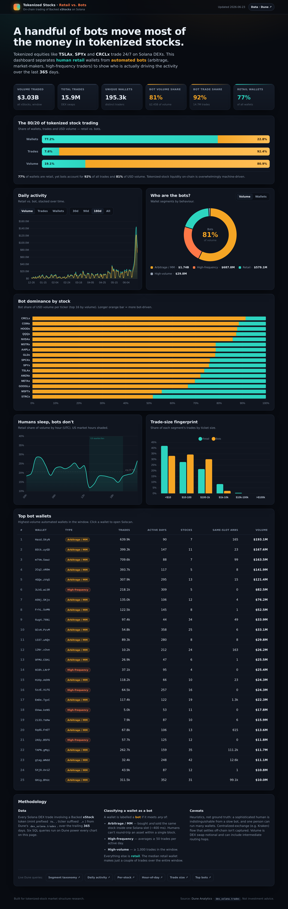

# Tokenized Stocks: Retail vs. Bots

A Dune-powered dashboard that separates **human retail** from **automated bots** in the on-chain
trading of tokenized equities — Backed **xStocks** (TSLAx, SPYx, CRCLx, NVDAx, AAPLx, …) on Solana.



> **Headline (trailing 365 days):** bots are **22.8%** of wallets but **92.4%** of trades and
> **80.9%** of USD volume ($2.45B of $3.03B). Tokenized-stock liquidity on-chain is overwhelmingly
> machine-driven, while the long tail of real humans trades rarely and in larger tickets.

---

## What it shows

| Panel | Question it answers |
|---|---|
| KPI strip + 80/20 split | How lopsided is wallets vs. trades vs. volume between retail and bots? |
| Daily activity | How has the retail/bot mix evolved since the June 2025 launch? (toggle volume / trades / wallets, 30–365d) |
| Bot taxonomy donut | What *kind* of bots — arbitrage/MM, high-frequency, high-volume? |
| Bot dominance by stock | Which tickers are most bot-driven vs. most retail? |
| Hour-of-day | Do humans trade on a US-market-hours clock while bots run 24/7? |
| Trade-size fingerprint | Retail vs. bot ticket-size distribution |
| Top bot wallets | The highest-volume automated wallets (links to Solscan) |

## Methodology

**Universe.** Every Solana DEX swap touching a Backed xStock token, from Dune's
[`dex_solana.trades`](https://docs.dune.com/data-catalog/solana/dex/trades). xStocks are identified by
their vanity mint prefix `Xs…` combined with the `…x` ticker suffix (e.g. `TSLAx` /
`XsDoVfqeBukxuZHWhdvWHBhgEHjGNst4MLodqsJHzoB`), which excludes memecoin noise.

**Bot classification.** A wallet is labelled a **bot** if it meets *any* of:

1. **Arbitrage / MM** — it bought **and** sold the same stock inside a single Solana slot (~400 ms).
   A human cannot round-trip an asset within one block; this is the strongest automation tell and the
   single largest bot cohort.
2. **High-frequency** — it averages **≥ 50 trades per active day**.
3. **High-volume** — it makes **≥ 1,000 trades** in the window.

Everything else is **retail**. (For reference, the median retail wallet makes ~2 trades over the
*entire* window.) Thresholds were calibrated against the observed trade-count and inter-trade
distributions; see the SQL in [`queries/`](queries).

**Caveats.** These are heuristics, not ground truth: a sophisticated human looks like a slow bot, one
person can run many wallets, and centralized-exchange flow (e.g. Kraken) that settles off-chain is not
captured. Volume is DEX swap notional and may include intermediate routing hops.

## Project layout

```
tokenized-stocks-dashboard/
├── index.html          # dashboard markup
├── styles.css          # dark theme
├── app.js              # loads data/*.json, renders all charts
├── vendor/             # Chart.js (vendored — no external CDN needed)
├── data/*.json         # cached Dune query results (committed so the page is static)
├── queries/*.sql       # the six Dune SQL queries, plus manifest.json (query IDs)
└── scripts/refresh.py  # re-runs the queries on Dune and rewrites data/*.json
```

The page is **fully static** — `data/*.json` is committed, so it works on GitHub Pages or any static
host with no backend and no API key in the browser.

## View it locally

`fetch()` needs HTTP (not `file://`), so serve the folder:

```bash
cd tokenized-stocks-dashboard
python3 -m http.server 8000
# open http://localhost:8000
```

### Publish on GitHub Pages
Enable Pages for this repo (Settings → Pages → deploy from branch). The dashboard will be served at
`https://<user>.github.io/tokenized-stocks-dashboard/`.

## Refresh the data

The six queries live on Dune (IDs in [`queries/manifest.json`](queries/manifest.json)).
To re-run them and regenerate the cached JSON:

```bash
export DUNE_API_KEY=your_key
python3 scripts/refresh.py            # refresh all
python3 scripts/refresh.py daily token   # or a subset
```

`refresh.py` PATCHes the existing Dune queries (creating them on first run), executes each, polls for
completion, and writes `data/*.json` + `data/meta.json`. The dashboard reflects the new data on reload.

> The window is set by `WINDOW` (days) at the top of `scripts/refresh.py`; the SQL files in `queries/`
> are exported copies for reference.

---

*On-chain market-structure research. Source: Dune Analytics · `dex_solana.trades`. Not investment advice.*
